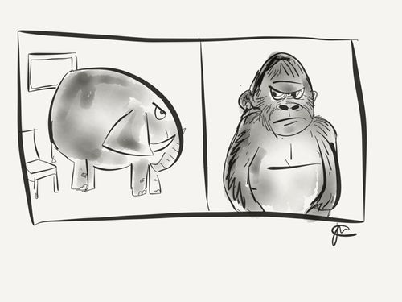
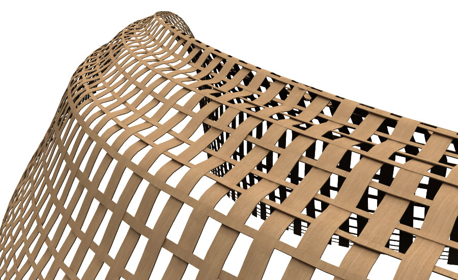

In the case of software engineering design patterns put, the otherwise ignored elephant in the room that is the creative side of computer science, into the spotlight.  Most programmers don’t even think of CS as being something that is creative, as their eyes have been colored in with the dry erase pens from white board tests, and their face sat upon by the 800 pound gorilla that is discrete math.  But if you look at the notion of design patterns from any other branch of human innovation you’ll see that they actually fit into a the larger set of patterns that encompass many art forms.  Look at textiles, weaving has been a part of humanity since the beginning.  The design pattern being, the algorithm that is specific to that style of weaving. The only difference really is that when one looks at the final product of a piece of software, what a programmer would consider the design pattern will never be visible to the eye.

That’s right, design patterns in sense of software engineering have nothing to do with the visual medium of a program.  While it would be good to follow a certain underlying theme in your user interface, when an engineer is talking design patterns, they’re talking about the structure of their code.  As one can already probably tell, quelling into the subject of design patterns via computer science, with no knowledge of programming will make your face hurt (not from the gorilla.)  Being aware of object oriented programming and the concept of polymorphism is the 800 pound gorilla of understanding design patterns.  The most common way to explain anything subject in computer science is to sit them down and draw lots of squares with arrows pointing and stuff.  But since this is an essay and not a screen cast I will do my best with my words.

When one is programming, one is creating a dealing with discrete objects, these objects are given special properties that inflict certain behaviors on your program.  Certain objects need to be affected and changed when they are passed by other objects, some objects need to be similar but not Identical to an object. At some point someone created the notion of polymorphism, where as a many objects(children) can inherit traits from an object(parent.)  This started to help redundancy in the code, and to hide the underlying function of certain objects traits from people who don’t really need to see how those traits work.

An example of a design pattern would be the observer solution.  Lets say you have an object called subject that holds a collection of observer objects as one of its main properties as well as function properties notify objects from the observer collection when certain events occur in your software.  The observer object observes and waits to be notified of the certain behaviors that it needs to do.
	
I’m starting to think that teaching computer science might be more challenging than actual programming.  I think a lot of people would disagree because the existence of design patterns.  Luckily there are is a vast ocean of design patterns out there to choose from.  For me when I have so many choices its really hard, and if you pick the wrong design pattern it would be extremely counter productive(you’d have to start over.) So I think the most important thing to take away from this lesson is to be aware of the popular designs,  and create something that works specifically for your program but resembles a pattern that already exists.

And remember, trying to woo a stubborn elephant while wrestling an 800 gorilla, is best done as a team.
