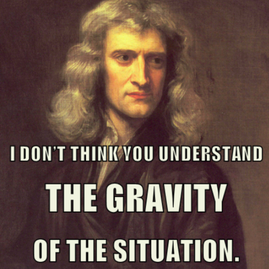

There’s a growing trend these days of people placing blame on the internet for being hurtful to our society. And by internet I mean all software as well, because almost all software utilizes the internet, therefore they’ve kind of become one. You can’t deny, the internet has changed everything, and will continue to do so for very a long time. But what effect does it have on us as humans? Are we addicts? Or are we just three year olds trying to play sudoku?

## Is the internet/software addictive?
First of all I’m in full agreement, the internet is a hundred percent addictive. I mean I saw a video on social media the other day, of some kid shrieking in horror as his dad ran over his xbox games with the lawn mower.  There's no argument against it, I myself spent countless hours as a child playing video games myself. Realistically though, is there anything that exists, that isn’t addictive? People would argue that there are good addictions and bad addictions, while this is mostly certainly true; who gets to decide this? Trump?  So my point is, merely acknowledging that something is addictive is not enough to witchify it as something that is harmful to society.

## Is mainstream software harmful? 
Once again I agree that the internet is very harmful, but let me conjure up a quick example as to explain why I think it is.  Look at what we have done to social media, imagine if Sir Isaac Newton came to the present and we first showed how the internet has helped us put communicate with satellites from small devices all over the world,I bet he’d be pretty impressed at the progress we’ve since he “discovered gravity”. But then imagine after we showed him what the internet is capable of, we showed him facebook.  I think he might be just a tad disappointed. Common people, stop blaming the internet(by post via internet) and do something productive for once in your lives.  We have to remember that the only way that this software works is if we pick it up and use it.  Thus the only way that software can be harmful is if people intend to cause harm with it. 

## Shame on you!!
That’s right, how dare you blame the internet. The internet doesn't ruin people, people ruined the internet.  Its funny how the Department of Defense funded the original entity that our internet sprouted from, so that they could  communicate quickly and anonymously with each other around the world, and now it's morphed into put everything you know about yourself online, and then get mad when people(corporations) take advantage. You see the problem here, shame one you for your lack of appreciation for this amazing tool computer science has given us.

