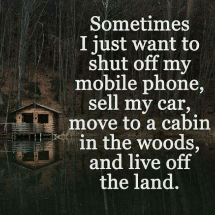

Too many times these days, have I been meandering my way through facebook of all places only to find a that people are posting articles and videos about the harmfulness of technology.  “What blind arrogance!” “Do we not understand the meaning of irony?” In all seriousness though this is a growing concern, in nearly thirty years we’ve gone from pagers to our president tweeting the nation with no sense of orthography.  Not to mention the past two hundred years, how far we’ve come.  Most people are on the fence about this, as I found in some polls taken on the National Association of Independent Schools website, in the most basic sense, parents are extremely happy about the convenience that technology has brought to raising a child, but also deeply concerned about how it affects their child's personality from a social standpoint.  
From my personal experience, I grew up on an avocado farm on Kauai, and I wasn’t really exposed to technology, besides for at friends houses, until I was seven, I rode my bike to the gas station to buy candy and found a hundred dollar bill on the ground, I stashed my bike in the bushes, took the bus into town and bought a Super Nintendo, which at that time was already old news as Playstation had been out for a couple of years.  Man was mom angry, luckly my dad defended me and I was allowed keep it.  As far as how technology has affected me since then, I am also on the fence; I may have not gone outside as much, but I wouldn’t be where I am today if it wasn’t for my enthusiasm with game art. 

## Who’s not on the fence?
As I said, I grew up on an avocado farm on Kauai, and Kauai is a magnet for these anti-technology types who come to the island hoping to work on a farm and “live off the land.” Let me make it clear that there is nothing wrong “living off the land.” My personal belief is that the right combination of digital technology and old sustainable technology would greatly improve society, and we as humans need to look deeply into this.  But I can tell you right now that majority of the people who were doing farm-work trade(“living off land”) and managed to stay on Kauai, are not doing that anymore. In fact as you read this they’re probably driving their 2018 Tacoma to a hot yoga class while drinking a thirty dollar Laird Hamilton bullet coffee with bee pollen.   

## So what is the Point?
My point is that, most first world humans are not cut out for “living off the land,” it’s too late, your culture has already striped you of your humanity, you’ve become something else. For those still not convinced I’ve fashioned a Star Waresc allegory to further magnify the point I’m trying to make.  

## Did Star Wars have the Internet?
While its highly probable that George Lucas had no conception of the internet during the production of episodes four, five, and six, Star Wars did in fact have the internet. How else would Darth Vader have built the death star? well I guess he could have assembled it using the force, but it was way easyier to just give natzis the internet and let them do it.  Now for the sake of the allegory, let’s say that the Death Star represents technology as we know it. Just like technology the Death Star, in the wrong hands, has the power to destroy a planet, but from a scientific standpoint is the collosal achievement. Now the rebel forces represent this growing trend of people wanting to reject technology but still using it all time.  Look at the characters; R2D2 is really just a router on wheels, probably even has 5G. How else would have Princess Leia uploaded a holographic selfie to the rebel forces instagram page? Luke on the other hand has force so I’ll say that his X-wing fighter only has the communication power of a 2004 flip phone. Which would explain why he got stuck on Dagobah, he only had half a bar.  As for the millennium falcon, it’s really old, so it only gets one AM radio station that plays ‘Democracy Now’ on repeat.  Chewbacca does have an Iphone ten but he keeps it hidden in his fur, and doesn’t tell Han about it, because ‘Democracy Now’ is a very informative broadcast it’s more fun that way. In the fourth episode the rebel forces destroy the death star, they win, technology is gone, but Darth Vader is not dead.  Just like if we destroyed the internet it would most likely come back because the people who made it would still be alive.  Which is exactly what happens, Darth Vader finds more Natzis and “WHOOF!” another death star.  Which brings us to episode six where the rebel forces destroy the Death Star again (in the same exact way, nice job George Lucas.) Only this time they manage to kill Darth Vader.  So once again all technology is gone and the galaxy is at peace and everyone can go back to living off the land.

Don’t you think it would have been smarter for the rebel forces tho comebere the death star and utilize its technology for something ethical. Because if you think about science is not going anywhere. Imagine if a meteor hit earth and all life was destroyed. But after millions of years organic life once again takes hold and a species with human like intelligence evolves again.  The difference between science and religion is that these humanoids would discover the laws of science again and they would be no different, while religion would be completely different. 

There will always be another death star. What can we do about this? My best advice would be to nurture it.  Since technology will never go away the best action we can take is to be responsible with it. Fight against these big companies who would prefer if you didn’t have a grasp for how technology works. Treat the internet as a gift, and not as a way to kill time. Learn as much as you can about it and pass down that knowledge because it's our best hope of survival. 

