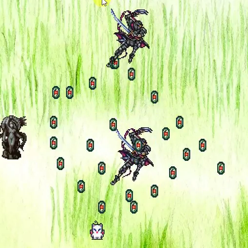

Ninja shepard is the first game I designed and wrote in my first computer science class at the University of Hawaii at Manoa.
I did this project on my own with the EZ graphics library(link provided below.) All the art and sounds is from Square Softs Final Fantasy series, in particular Final Fantasy 6, and Final Fantasy 7. If you're a Final Fantasy fan you'll notice that shepard is a moogle.

Control the shepard(the little white rat in the middle of the screen) with the arrow keys and lay down traps, which slow down the ninjas. The statues give you a blessing and refills your trap quiver, but you can only get so many blessings, which means your traps are limited. This is where the main point of the game, its all about the pattern in which you lay the traps. As you could see on my youtube video I wasn't able to beat it with out editing the ninja count down to eight ninjas. The hard coded game has the ninja count set at twenty, which makes for quite the challenge. I only beat it a handful of times, but when I did, I got my dopamine blast, thus confirming the over-all appeal of Ninja Shepard.

Ninja Shepard is by no means a good game, I mean, the code is hideous, last time I looked at it I felt dizzy. But it being my first game and all; I was suprised at myself, because I was able to make something that had a good balence between challenging and beatable, which I believe is one of the main issues that game developers face today.

 
Source: <a href="https://github.com/zakgilbert/NinjaShepard"><i class="large github icon"></i>zakgilbert/NinjaShepard</a>

You can see Ninja Shepard gameplay at the [You Tube](https://www.youtube.com/watch?v=U4HBGTayWi0).
