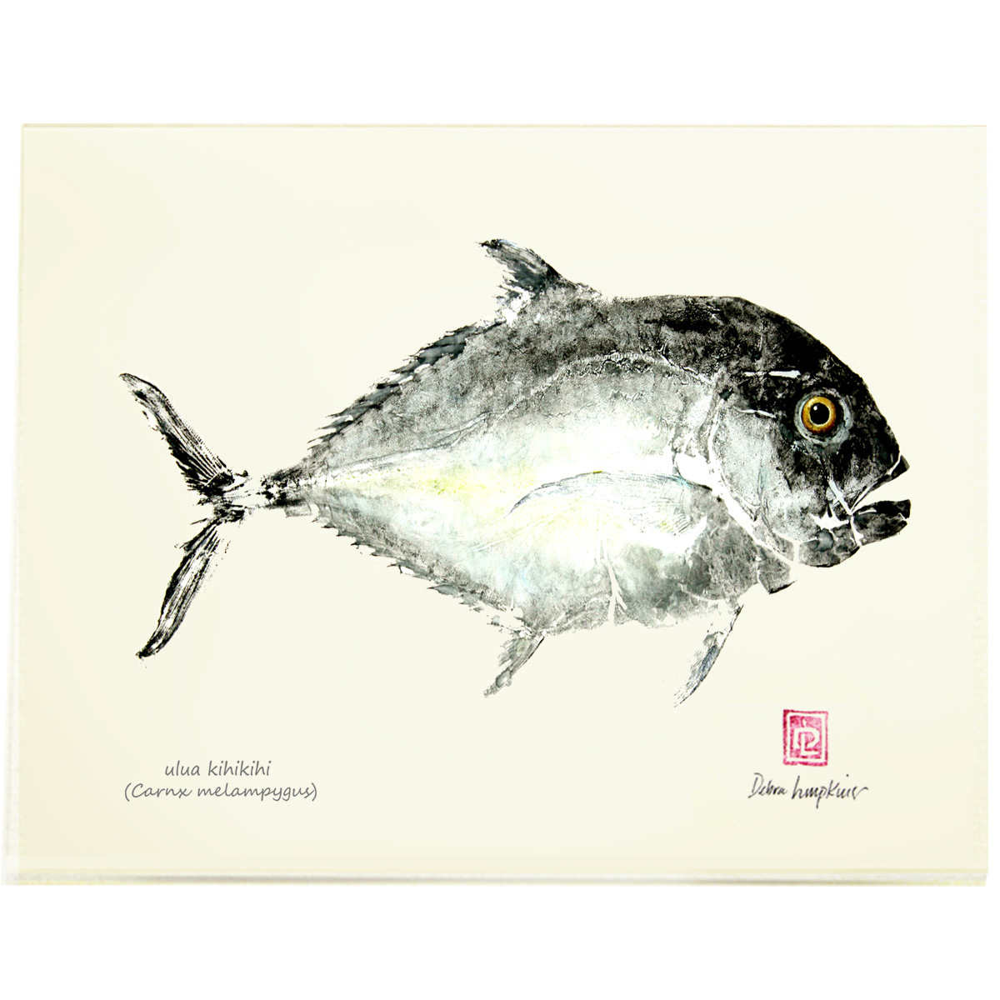
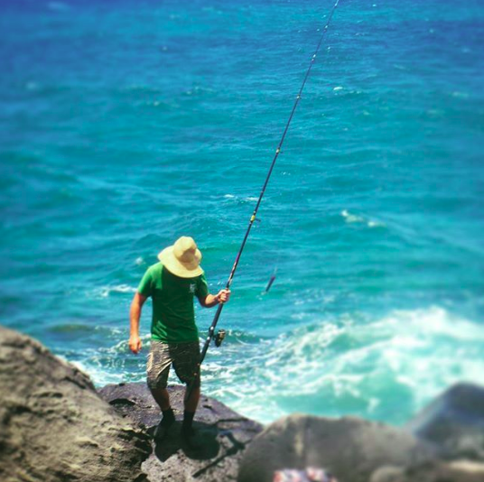
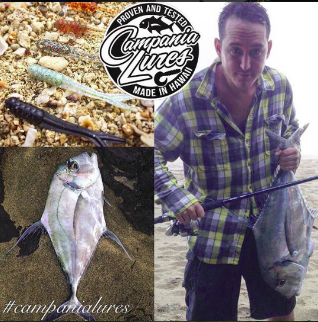

Hawaiian Fishing Log is a mobile application I plan to develop in the near future. From my years of shore fishing on Kauai I have beared witness to the spike of popularity shore fishing has taken on in the past five years. My theory is that this was caused by the growing popularity of Instagram and Facebook where shore fisherpeople began to post their catches for their friends online. In reaction to this many people young and old have grabbed their tackle and poles creating a new generation of shoreline fisherpeople here in Hawaii.

The Hawaiian Fishing Log(HFL) software takes this notion of posting ones catches and cranks it up a few notches. Not only will a user be able to post his or her catches and share it with their friends, they will be able to record data about their catch.  Some data will have to be input manually; rod, reel, lure, and the fishes dimensions; but a lot of the data will be stored automatically; such as tide, moon-phase, date, time, and location.  

One may one wonder, “why would a fisherperson want to have all that?”  One of the key components of shore fishing is being in the right place at the right time. It takes years to develop a sense for this.  HFL give fisherpeople an advantage by letting them cross reference their data and gain an idea for what variables work best for them.  Not only that, they would would be able to create groups and merge data to see if their tendencies as fishpeople hold strong in the case of other fisher people.

For me the most exciting feature of HFL is that the software would give any user the ability to hold fishing contests.  These in my vision would be judged on the fishes length (not the weight) thus all you would need to do is post a picture of the fish being measured.  Not only would this give fisherpeople the ability to hold statewide competitions, it would open Hawaii up to the notion of tag and release fishing contests.

