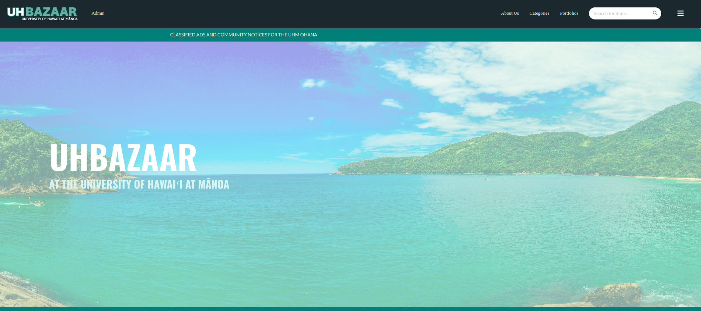
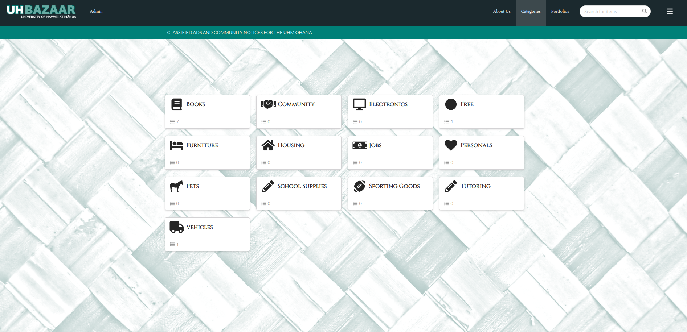
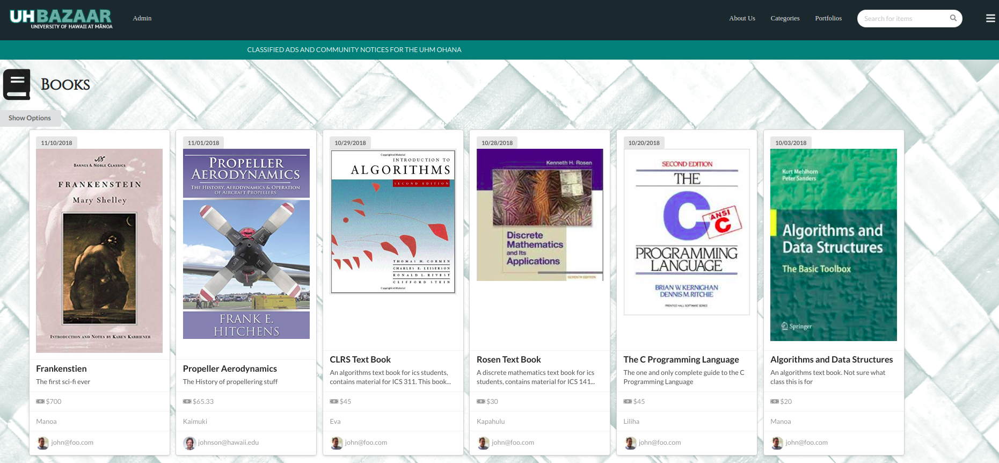
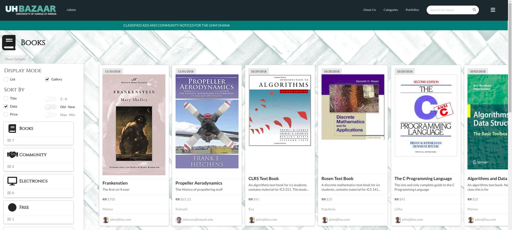

[Uh Bazaar](http://uhbazaar.meteorapp.com/#/) is a user based web app geared towards the University of Hawaii at Manoa that [Wyatt Hoodes](https://github.com/whoodes), [Leahmei Villanueva](https://github.com/leahmeiv), [Michael Boyle](https://github.com/boyle-michael), and I, put together for our Information and Computer Sciences 314: Software Engineering classes final project.  It shares a commonality with craiglist as it gives a user the ability to place and post items that they want for sale.  A user must have an account and be logged in, in order to access the market. 

### How I Played My Part 



After making a profile a user navigates to the categories pages via the navigation bar at the top of the page, this is the beginning of my main focus in the development of this app. The categories are listed dynamically from the apps data pool.  Someone with administrative access can add and remove categories.  When a user adds an item they choose from the list of categories.  



When a user clicks on a category, they are brought to the category page, which displays all the items for sale within that category.  The items are listed dynamically through the category menu component.  The details of the item are broadcast via the [card module from semantic react](https://react.semantic-ui.com/views/card/) . 




The user can sort the items in various ways and switch to a list view.  The user can only sort by one option at a time, thus only one checkbox can appear to be checked at a time.  If you move the slider to the right it will reverse the order of the current sort function you are using. Implementing the check boxes to sort and display properly was probably the most challenging programming I've done in this class. Here's my checkbox jsx function.

```
const titleCheckbox = (
        <Checkbox checked={this.state.titleIsActive} onClick={() => this.setState({
          sorter: 'title',
          titleIsActive: true,
          dateToggle: false,
          priceToggle: false,
          dateIsActive: false,
          priceIsActive: false,
          reverse: false,
        })} label='Title'/>
    );
```
Basically if that checkbox is clicked on it will rerender the page using ```setState``` with all these certain boolean states set to the appropriate logic. Here's my sorting function

```
sortByItem(items, cat, sortKey, Component, reverse) {
    const stuff = sortBy(items, sortKey);
    if (reverse) {
      stuff.reverse();
      this.setState.reverse = false;
    }
    return stuff.filter(item => item.category === cat).map((item) => <Component key={item._id} item={item}/>);
  }
```
And for the toggle switches we have this...
```
const priceToggle = (
        <Checkbox checked={this.state.priceToggle} disabled={!this.state.priceIsActive}
                  onClick={() => this.setState({ priceToggle: !this.state.priceToggle, reverse: !this.state.reverse })}
                  toggle
                  label={toggleName(this.state.priceToggle, 'Min - Max')}/>

    );
```
I found that encapsulating the more bulky react modules into *jsx* functions to be advantageous to me and my discovery of the possibles of javascript.  

I very much enjoyed this project and will probably begin working on a [new web app](https://zakgilbert.github.io/projects/hawaiianFishingLog), over christmas break.  


